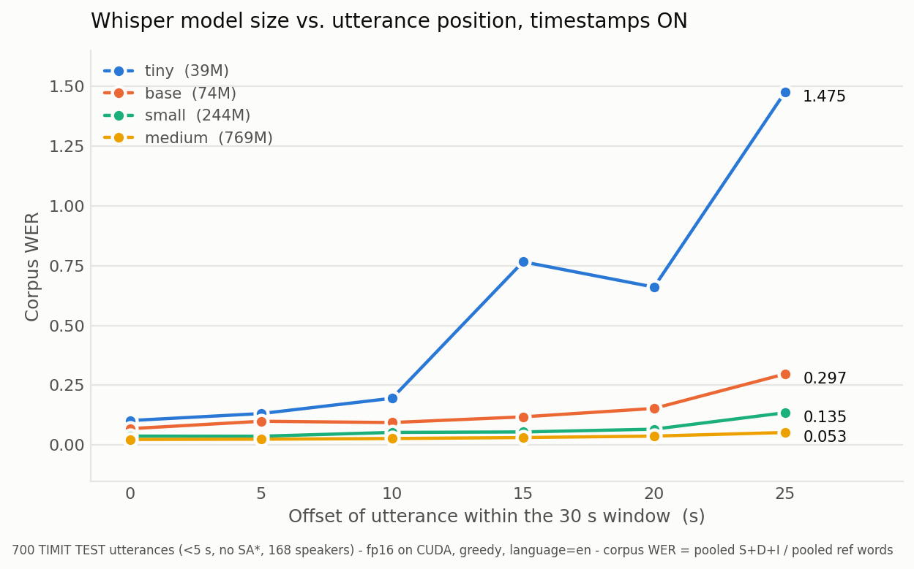

# Positional dependence of Whisper's predictions

**Objective: determine whether *where* a short utterance sits inside Whisper's fixed 30 s input
window changes what the model transcribes — and if so, why, and whether it survives scale.**

Whisper always encodes exactly 30 s. A 3 s utterance therefore occupies ~10% of the window and
the remaining ~90% is padding. Nothing about the acoustics changes when that utterance is moved
from the start of the window to the end; the audio is bit-identical and only its position differs.
If the transcript changes, that is a property of the model, not of the speech.

It does change — substantially, and only under some decoding configurations.

## Headline result

Whisper `base`, 1000 TIMIT `TEST` utterances, corpus WER at six offsets:

| offset | timestamps ON | timestamps OFF |
|--------:|-----:|-----:|
| 0 s  | 0.0705 | 0.0810 |
| 5 s  | 0.0970 | 0.0732 |
| 10 s | 0.0962 | 0.0779 |
| 15 s | 0.1129 | 0.0707 |
| 20 s | 0.1547 | 0.0716 |
| 25 s | **0.2981** | 0.0780 |

- **With timestamps disabled, position is nearly irrelevant** — WER stays inside 0.071–0.081 with
  no trend.
- **With timestamps enabled, WER quadruples** across the window.
- **But the median per-file WER is 0.0000 at every offset in both arms.** The corpus effect is
  entirely tail-driven: at a 25 s offset the top 1% of files carry 44% of all errors and 612/1000
  files are still transcribed perfectly. Position does not gradually degrade transcription — it
  raises the probability of *catastrophic looping hallucination*. Runaway outputs (>3× the
  reference length) go 0 → 19 as the offset grows; insertions go 114 → 1451.
- Example: `DR6/MESD0/SI1632`, reference *"Fuss, fuss, old man."* At a 25 s offset the model
  returns *"I'm going to be a little bit more careful."* repeated until the token limit. The same
  file at offset 0 is exact.

Because the effect is tail-driven, **per-file averages hide it** and small corpora understate it.
Quote the corpus WER, and keep the corpus large enough to contain the tail.

## Notebooks

| Notebook | Question it answers |
|---|---|
| `Aug_23.ipynb` | Does position change the transcript? Isolates the effect with `whisper.decode()` — one encoder pass, one greedy decode, nothing else. |
| `Transcribe_Offset.ipynb` | What does the full `transcribe()` pipeline add on top? Same clips, greedy and stock-fallback arms. |
| `Colab_ModelScaling.ipynb` | Does the effect shrink with model size? `tiny`/`base`/`small`/`medium` on a Colab GPU — **run, see below**. [](https://colab.research.google.com/github/AgrfhyL/audio_model_initial_testing/blob/main/Colab_ModelScaling.ipynb) |
| `Colab_PositionalEmbedding.ipynb` | Does the positional embedding *cause* it? P0–P4 displace the embedding directly. [](https://colab.research.google.com/github/AgrfhyL/audio_model_initial_testing/blob/main/Colab_PositionalEmbedding.ipynb) |
| `Colab_ExperimentC.ipynb` | Is the effect in the encoder or the decoder? Teacher-forced ΔNLL, timestamp-margin pressure, generated behaviour. [](https://colab.research.google.com/github/AgrfhyL/audio_model_initial_testing/blob/main/Colab_ExperimentC.ipynb) |

Earlier, discontinued work lives in [`archive/`](archive/) — a five-encoder self-supervised
probing study and a 10-file Whisper WER warm-up. Neither is being continued.

## Does scale remove it? Partly.

`tiny`/`base`/`small`/`medium` on 700 clips, Colab T4, fp16 (41 min). Ratio is WER at a 25 s
offset over WER at 0 s — the positional penalty, normalised for each model's baseline accuracy:

| model | params | 0 s | 5 s | 10 s | 15 s | 20 s | 25 s | **25s/0s** |
|---|---:|---:|---:|---:|---:|---:|---:|---:|
| tiny | 39M | 0.1025 | 0.1317 | 0.1957 | 0.7661 | 0.6604 | **1.4752** | **14.4×** |
| base | 74M | 0.0686 | 0.0995 | 0.0942 | 0.1180 | 0.1532 | 0.2971 | 4.3× |
| small | 244M | 0.0375 | 0.0370 | 0.0530 | 0.0549 | 0.0665 | 0.1352 | 3.6× |
| medium | 769M | 0.0235 | 0.0247 | 0.0274 | 0.0315 | 0.0375 | 0.0526 | 2.2× |

*(timestamps ON. With timestamps OFF every model is flat: ratios 1.07, 0.89, 1.01, 0.98.)*

- **The penalty shrinks monotonically with scale — 14.4× → 4.3× → 3.6× → 2.2× — but does not
  disappear.** Even `medium` still more than doubles its WER purely by moving the audio.
- **`tiny` exceeds 100% WER at a 25 s offset** (1.4752). WER is unbounded above when the model
  emits more words than the reference; at that offset `tiny` is generating several times the
  reference length in looping hallucination. Its curve is also non-monotonic (0.766 at 15 s,
  0.660 at 20 s), which is what a corpus dominated by a few catastrophic outputs looks like.
- **Timestamps remain the whole story at every scale.** With them off, all four models are flat
  across the window; the effect is a property of timestamp-conditioned decoding, not of the
  acoustic encoder.



The Colab `base` run also serves as a cross-check on the whole apparatus: predicted from the local
fp32/MPS data on the same 700-clip subset, offset-25 WER should be **0.2975**; the Colab fp16/CUDA
run returned **0.2971**. A 0.0004 gap across a different device, precision and framework build.

## Which utterances carry it?

Corpus WER says late placement hurts; it cannot say *which* utterances. `Colab_DeltaSweep.ipynb`
measures a paired per-utterance quantity over **all 1000 clips** — the same corpus `Aug_23.ipynb`
scored, so results join to it by `path` — across `tiny`, `base`, `small`, `medium` and
`large-v3`:

```
delta_m = [WER(m, 25s, ts on)  - WER(m, 5s, ts on) ]
        - [WER(m, 25s, ts off) - WER(m, 5s, ts off)]
```

A difference in differences. The inner brackets are the cost of moving that utterance from 5 s to
25 s, with and without timestamps; subtracting removes any position effect independent of
timestamps along with every per-utterance confound constant across offsets — speaker, sentence,
duration, difficulty. What remains is the penalty that exists *only because timestamps are on*,
isolated per utterance. 5 s is the baseline rather than 0 s because offset 0 is the one position
whose mel is not a pure shift (reflect padding); 5 s and 25 s are exact integer-frame shifts of
one another.

The distribution is **zero-inflated and heavy-tailed** — over all 1000 clips on the local `base`
run, 782 were exactly 0, 171 positive, 47 negative, mean `+0.226` against a median of `0.000`. Mean and median therefore say different things, so the notebook reports prevalence
(how many utterances are affected) and severity (how much) separately, each with an interval
matched to the quantity:

- **mean `delta_m`** — BCa bootstrap, 10 000 resamples of size 1000. The skew makes the naive
  percentile interval biased, so endpoints come from BCa-adjusted percentiles.
- **proportions** — Wilson score intervals, which stay inside `[0, 1]` and behave at small counts.
- **sign test** — exact two-sided binomial on positives vs negatives among affected utterances;
  distribution-free, so the heavy tail cannot distort it.

Batch size is held at **8 for every model** — it divides 1000 exactly, so no model ends on a
ragged remainder batch, and it fits `large-v3` on a T4 without the memory limit ever being
discovered by hitting it. Decode output was verified byte-identical at batch 16/8/4/1 in both
fp32 and fp16, so this is about holding a nuisance parameter constant rather than fixing a known
error.

On the `base` run the mean is `+0.226`, CI `[+0.138, +0.378]` from 10 000 BCa resamples of size
1000 — excluding zero, but wide and asymmetric because a handful of utterances drive it. 17.1% of
utterances have `delta_m > 0` (Wilson `[14.9%, 19.6%]`), and among affected ones 78% are hurt
rather than helped (sign test *p* < 1e-5). A speaker-clustered interval is reported alongside as a
cross-check on the independence assumption; the two agree closely here (`[+0.145, +0.377]`).

## What causes it? Editing the positional embedding

`Colab_PositionalEmbedding.ipynb`. Whisper's `AudioEncoder` adds a fixed sinusoidal embedding
after the convolutions — a `register_buffer`, not a learned parameter, of shape `(1500, n_state)`,
so 1500 frames over 30 s means **50 frames per second**. Overwriting it isolates position from
everything else: the audio stays byte-identical, only its label changes.

| | audio at | positional embedding | first timestamp |
|---|---|---|---|
| P0 | 5 s | unchanged | capped (stock) |
| P1 | 25 s | unchanged | capped |
| P2 | 25 s | displaced −20 s | capped |
| P3 | 25 s | displaced +20 s (wraps to 15 s) | capped |
| P4 | 25 s | unchanged | **uncapped** |

P0–P3 run with timestamps on and off; P4 only with them on. 45 000 decodes across five models.

**The displacement must be a cyclic roll, not extrapolated sinusoids.** Rebuilding the sinusoids at
`arange(1500) - 1000` gives the leading silence frames *negative* positions the model never saw in
training, and that is catastrophic — measured on 60 clips at 25 s with timestamps off, corpus WER
goes from 0.0586 to **6.4163** with 18/60 outputs collapsing into repetition loops. A roll assigns
every frame a genuine training-time position and avoids it. This matters because the naive version
looks like it works if you only check files that were already failing.

Early indication from a 16-clip local probe on `base` (timestamps on): P0 0.0661, P1 0.4793,
**P2 0.0661** — the displacement fully recovers the baseline — and P4 0.4380, meaning the
`max_initial_timestamp` cap accounts for very little of the penalty. The full 1000-clip run across
five models is what settles it.

## Encoder or decoder? Experiment C

`Colab_ExperimentC.ipynb`. Rolling the positional embedding shows it is **sufficient** to produce
the penalty, but not where the penalty lives — the roll changes the encoder output, and the encoder
output is what the decoder cross-attends to. Two stories fit equally well:

| | claim |
|---|---|
| **Encoder account** | placing audio at 25 s degrades the acoustic representation; the roll repairs it |
| **Decoder account** | the representation is fine, but carries an intact position signal the decoder mishandles once timestamp tokens are live; the roll removes the *cue*, not a *defect* |

Three measurements separate them, on conditions C0 (5 s), C1 (25 s) and C2 (25 s with the
embedding rolled −20 s), each with timestamps on and off:

**1. Teacher-forced ΔNLL.** Force the model down the reference token sequence and score the text
tokens. The path is fixed by construction, so looping, the timestamp rules and the token cap cannot
contribute — what is left reads whether the representation still supports the correct words.
`ΔNLL = NLL(25 s) − NLL(5 s)`, paired per utterance. Levels are not comparable across model sizes,
but this within-model difference cancels baseline competence.

**2. The timestamp margin.** `logsumexp(timestamp logprobs) − max(text logprobs)`, which is not an
invented metric but verbatim the decision variable of Whisper's own `ApplyTimestampRules`. Above
zero, every text token is masked to `−inf` and the decoder is *forced* to emit a timestamp — and
that filter exists only in the timestamps-on arm, which is exactly how the two arms diverge while
sharing an encoder.

**3. Generated behaviour.** A free `decode()` on the same representation: timestamps emitted,
output length against reference length, insertions, token-cap hits.

The discriminator is the **shape across scale**. The penalty is already known to shrink 14.4× →
2.2×; the encoder account predicts ΔNLL shrinks with it, the decoder account predicts ΔNLL stays
flat while the runaway rate falls. The two are not mutually exclusive, so the notebook reports the
split rather than picking a winner.

## What makes the comparison valid

The experiment is only meaningful if moving the audio changes *nothing but* its position. Three
controls establish that, and each is asserted in the notebooks rather than assumed:

- **The mel is bit-identical under shift.** Offsets are integer multiples of `HOP_LENGTH = 160`,
  so shifting the waveform shifts the mel frames exactly. Verified across all 1000 files at
  offsets 5–25 s: maximum deviation `0.000e+00`.
- **The global scale does not move.** `log_mel_spectrogram` clamps against `log_spec.max() - 8.0`
  computed over the *entire* 30 s frame, so a position-dependent maximum would silently rescale
  everything. Drift measured at `0.000e+00`.
- **Offset 0 is the one exception, by construction.** `torch.stft(center=True)` reflect-pads 200
  samples; at offset 0 that mirrors the utterance's own opening instead of zeros, perturbing mel
  frames 0–1. Offset 0 is still the canonical `pad_or_trim` condition and belongs in the results —
  it just is not a pure translation of the others.

Padding is zeros only, written into an exact `np.zeros(480000, float32)` buffer — never
`pad_or_trim`, which right-pads only and cannot express an offset. Decoding is greedy
(`temperature=0.0`, no beam, no best-of), language forced to `en`, task `transcribe`, no prompt or
prefix. Both hypothesis and reference pass through Whisper's own `EnglishTextNormalizer`, and WER
is pooled corpus-level, not a mean of per-file rates.

## Two mechanisms the follow-ups isolated

**`transcribe()` differs from `decode()` only by re-seeking.** With timestamps off the two are
bit-identical at every offset — without timestamp tokens the seek loop always advances a full
window and terminates in one pass. With timestamps on they diverge on exactly the files where the
loop re-seeks (19/19 at 15 s, 67/67 at 20 s, 120/121 at 25 s): when the closing timestamp falls
short of the window end, the tail is decoded again and a duplicate fragment is appended.

**The temperature fallback is what rescues the late-offset collapse.** Whisper's stock
`temperature=(0.0, 0.2, … 1.0)` re-decodes a window whose compression ratio exceeds 2.4. That cuts
the 25 s offset from 0.2981 to 0.1626 while firing on only 109/1000 files. A scalar
`temperature=0.0` makes the ladder unreachable, so `compression_ratio_threshold` and
`logprob_threshold` flag the runaway output and return it anyway. The position effect survives the
rescue regardless — stock fallback still runs 0.069 → 0.163 across the window.

Practical consequence: **on short clips with timestamps enabled, keep the stock temperature
fallback.** Switching to strict greedy silently disarms the one mechanism that catches positional
hallucination.

## Corpus

1000 TIMIT `TEST` utterances: under 5 s (so a 25 s offset still fits the window), at most 4.975 s
(so ≥400 zero samples of tail remain and the STFT's edge reflection stays over silence), excluding
the `SA*` shibboleth sentences that every speaker records. Drawn speaker-balanced with
`random.Random(0)` across all 168 speakers — 482 distinct sentences, 7918 reference words.

`corpus_digests.json` ships that selection as **paths and SHA-256 digests only, with no transcript
text**, ordered by the original draw so an N-clip subset is the first N entries. It lets any
machine rebuild and *verify* the identical corpus from its own TIMIT copy. The digest is taken
over the decoded float32 samples, so it pins the array that actually reaches the mel.

Locally, `corpus_frozen/` holds a self-contained copy plus provenance; `load_frozen()` (section 9
of `Aug_23.ipynb`) is the entry point for follow-up work and needs no TIMIT install.

### Subset size matters more than it looks

Because the effect lives in the tail, a small subset does not merely add noise — it systematically
understates the finding:

| N | offset-25 WER (ts on) | max deviation from the full curve |
|---:|---:|---:|
| 300 | 0.2064 | 0.092 |
| 500 | 0.2471 | 0.051 |
| 700 | 0.2975 | 0.005 |
| 1000 | 0.2981 | 0 |

At 300 clips only 3 runaway files survive instead of 19, and the timestamps-off curve gains a
spurious spike at offset 0 from a single hallucination — which would make the "position is
irrelevant without timestamps" conclusion look false.

## Getting the data

**TIMIT is not included in this repository.** It is distributed by the LDC as
[LDC93S1](https://catalog.ldc.upenn.edu/LDC93S1) and is licensed, not freely redistributable. You
need your own copy. Point `TIMIT_TEST` in `Aug_23.ipynb` at it.

TIMIT's `.WAV` files are **NIST SPHERE**, not RIFF/WAVE — `libsndfile` (and therefore `soundfile`)
reads them natively, returning 16 kHz mono float32. `scipy.io.wavfile` cannot. The layout is
`SPLIT/DR{1..8}/SPEAKER/UTT.WAV`, so a flat `os.listdir` finds nothing; reference transcripts are
in a sibling `.TXT` whose first two integers are sample offsets and must be stripped.

Everything that embeds TIMIT audio or transcripts is gitignored: `corpus_frozen/`,
`offset_manifest.json`, `offset_results.csv`, `transcribe_results.csv`,
`delta_results_full.csv`.

The Colab notebooks go further, because saving a Colab notebook back to GitHub commits its
outputs: they never print transcript text, they split results into a Drive-only file that carries
hypotheses and a git-safe file that carries only paths and numbers, and they assert that split
before writing. `Colab_DeltaSweep.ipynb` also records a full provenance block — package versions,
SHA-256 of the `whisper` source files that define the decode path, each checkpoint's digest
checked against the hash embedded in its download URL, device and precision, the verbatim
`DecodingOptions`, and digests over both the audio arrays and the *normalized references*. The
reference digest pins exactly what was scored without storing any transcript.

## Requirements

Python 3.12, with `openai-whisper` (20250625), `torch` 2.13, `soundfile`, `jiwer`, `numpy`,
`matplotlib`. Whisper checkpoints download on first use and cache to `~/.cache/whisper`.

The local experiments ran on Apple M2 via MPS in fp32 — verified deterministic, batch-size
invariant, and text-identical to CPU. The mel is always computed on **CPU in fp32**, which is a
control rather than a performance choice: it guarantees the bit-identical-shift property no matter
what the encoder runs on. `Colab_ModelScaling.ipynb` uses CUDA and fp16, and reads `n_mels` from
`model.dims` rather than hardcoding 80, since `large-v3` and `turbo` use 128.
